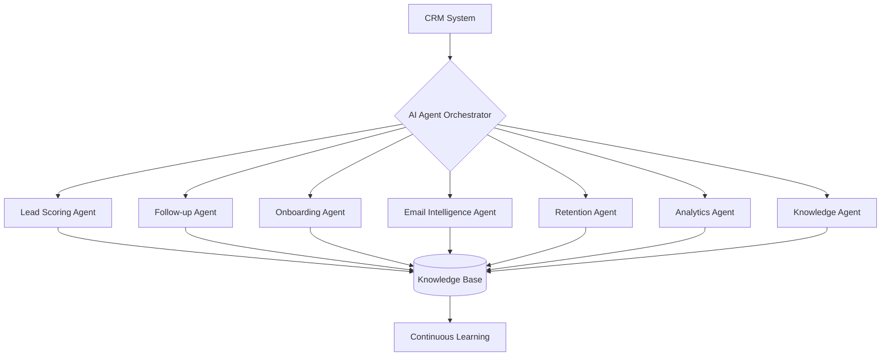
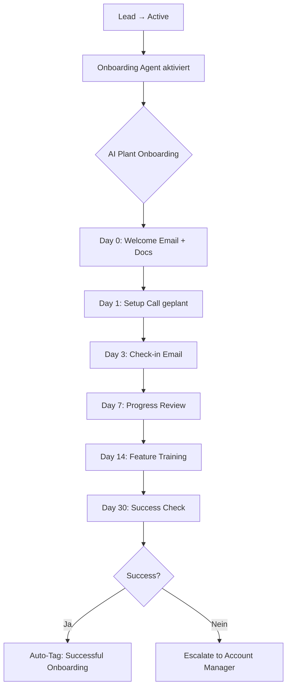

# 🤖 AI Automation Plan - CRM System

## 🎯 Ziel: Workflow von 15% → 85% Automatisierung

Basierend auf: **COMPANY_WORKFLOW.md**

---

## 📊 Aktuelle Situation

| Workflow | Manuelle Arbeit | Automatisierung | Zeit/Woche |
|----------|----------------|-----------------|------------|
| Lead Management | 95% | 5% | 12h |
| Customer Onboarding | 100% | 0% | 8h |
| Interaction Logging | 90% | 10% | 10h |
| Retention Monitoring | 100% | 0% | 6h |
| Reporting | 95% | 5% | 4h |
| **GESAMT** | **96%** | **4%** | **40h/Woche** |

**Ziel nach AI-Automation:** ~6h/Woche (85% Reduktion)

---

## 🤖 AI Agent Architecture

### Übersicht



---

## 1️⃣ **Lead Scoring Agent** 🎯

### Funktion
Automatische Bewertung neuer Leads basierend auf Daten + AI-Analyse

### Input
- Customer-Daten (Name, Email, Company, Notes)
- Externe Daten (LinkedIn, Company Website)
- Historische Conversion-Daten

### AI-Modell
```python
{
    "model": "Claude 3.5 Sonnet",
    "prompt": "Analysiere diesen Lead und score ihn 0-100:",
    "factors": [
        "Company Size",
        "Industry Fit",
        "Decision Maker Level",
        "Budget Indicators",
        "Timeline Signals"
    ]
}
```

### Output
```python
{
    "score": 85,  # 0-100
    "priority": "HIGH",  # LOW/MEDIUM/HIGH/URGENT
    "reasoning": "Fortune 500 company, C-Level contact, active buying signals",
    "recommended_actions": [
        "Schedule call within 24h",
        "Send personalized proposal",
        "Assign to Senior Account Manager"
    ],
    "estimated_value": "$50,000 ARR"
}
```

### Automatisierung
- ✅ Auto-Score bei neuem Lead
- ✅ Auto-Prioritization in Queue
- ✅ Auto-Assign zu passendem Account Manager
- ✅ Auto-Generated First Email
- ✅ Auto-Add zu Follow-up Schedule

### Zeitersparnis
**12h/Woche → 2h/Woche** (83% Reduktion)

---

## 2️⃣ **Follow-up Agent** 📞

### Funktion
Automatisches Follow-up Management + Reminder System

### Trigger
- Neue Interaction erstellt
- X Tage seit letzter Interaction
- Status-Änderung
- Manual Request

### AI-Logik
```python
def calculate_next_followup(customer, last_interaction):
    """
    AI entscheidet wann nächster Follow-up
    basierend auf:
    - Customer Status (lead vs active)
    - Interaction Type (call = 2-3 Tage, email = 5-7 Tage)
    - Sentiment des letzten Gesprächs
    - Sales Stage
    - Historical Response Times
    """

    context = {
        "customer": customer.to_dict(),
        "last_interaction": last_interaction.to_dict(),
        "history": get_interaction_history(customer),
        "industry_benchmarks": get_benchmarks(customer.industry)
    }

    ai_recommendation = claude.analyze(
        prompt="Wann ist der beste Zeitpunkt für Follow-up?",
        context=context
    )

    return {
        "next_date": ai_recommendation.date,
        "channel": ai_recommendation.channel,  # call/email/meeting
        "message_draft": ai_recommendation.template,
        "confidence": ai_recommendation.confidence
    }
```

### Features
- **Smart Scheduling**: AI wählt optimalen Zeitpunkt
- **Channel Selection**: Email vs Call vs Meeting
- **Template Generation**: Personalisierte Nachrichten
- **Sentiment Tracking**: Analysiert Gesprächston
- **Auto-Escalation**: Warnt bei Nicht-Antwort

### Automatisierung
- ✅ Auto-Create Follow-up Tasks
- ✅ Auto-Send Emails (mit Human Review)
- ✅ Auto-Escalate bei Inaktivität
- ✅ Auto-Update CRM Status

### Zeitersparnis
**10h/Woche → 3h/Woche** (70% Reduktion)

---

## 3️⃣ **Onboarding Agent** 🚀

### Funktion
Automatisierter Customer Onboarding Workflow

### Workflow


### AI-Features
1. **Personalized Onboarding Plan**
   ```python
   ai.generate_plan(
       customer_profile=customer,
       industry=customer.industry,
       use_case=customer.notes,
       team_size=customer.employees
   )
   # → 30-60-90 Day Plan
   ```

2. **Auto-Generated Content**
   - Welcome Email (personalisiert)
   - Setup Guide (industry-spezifisch)
   - Training Materials (role-basiert)
   - Check-in Questions

3. **Progress Tracking**
   - AI analysiert Interactions
   - Erkennt Blocker automatisch
   - Schlägt Lösungen vor

### Automatisierung
- ✅ Auto-Email Sequences
- ✅ Auto-Task Creation
- ✅ Auto-Doc Generation
- ✅ Auto-Meeting Scheduling
- ✅ Auto-Progress Reports

### Zeitersparnis
**8h/Woche → 1h/Woche** (87% Reduktion)

---

## 4️⃣ **Email Intelligence Agent** 📧

### Funktion
Automatische Email-Verarbeitung + CRM-Integration

### Features

#### A) Email → Interaction
```python
# Eingehende Email wird automatisch zu Interaction
{
    "from": "customer@company.com",
    "subject": "Re: Proposal Discussion",
    "body": "We'd like to move forward with..."
}

# AI extrahiert:
{
    "customer_id": auto_match_by_email(),
    "type": "email",
    "subject": "Positive response on proposal",
    "description": AI_SUMMARY,
    "sentiment": "POSITIVE",
    "action_items": [
        "Send contract",
        "Schedule kickoff call"
    ],
    "urgency": "HIGH"
}
```

#### B) Smart Categorization
- **Request**: Kundenanfrage
- **Question**: Technische Frage
- **Complaint**: Problem/Beschwerde
- **Feedback**: Positives/Negatives Feedback
- **Meeting**: Meeting-Request

#### C) Auto-Response (Optional)
```python
if simple_question and high_confidence:
    draft_response = ai.generate_response(
        email=incoming,
        knowledge_base=kb,
        customer_history=history
    )

    # Human Review vor Senden
    send_for_approval(draft_response)
```

#### D) Priority Routing
```python
if sentiment == "NEGATIVE" or urgency == "HIGH":
    notify_account_manager(immediate=True)
elif category == "TECHNICAL":
    assign_to_support_team()
else:
    add_to_queue()
```

### Automatisierung
- ✅ Auto-Parse Emails
- ✅ Auto-Create Interactions
- ✅ Auto-Extract Action Items
- ✅ Auto-Categorize
- ✅ Auto-Route to Team

### Zeitersparnis
**5h/Woche → 1h/Woche** (80% Reduktion)

---

## 5️⃣ **Retention Agent** 💰

### Funktion
Proaktives Customer Retention Management

### Monitoring
```python
class RetentionAgent:
    def monitor_customers(self):
        """Täglich alle Kunden prüfen"""

        for customer in Customer.query.filter_by(status='active'):
            risk_score = self.calculate_risk(customer)

            if risk_score > 70:  # HIGH RISK
                self.trigger_intervention(customer)
```

### Risk Scoring
```python
def calculate_risk(customer):
    """AI-basiertes Churn Risk Scoring"""

    factors = {
        "days_since_last_interaction": days_count(),
        "interaction_frequency_trend": calculate_trend(),
        "sentiment_trend": analyze_sentiments(),
        "support_ticket_increase": check_tickets(),
        "feature_usage_decline": check_usage(),
        "invoice_payment_delays": check_payments()
    }

    ai_analysis = claude.predict_churn(
        customer_data=customer.to_dict(),
        interaction_history=get_history(),
        factors=factors
    )

    return {
        "risk_score": 0-100,
        "risk_level": "LOW/MEDIUM/HIGH/CRITICAL",
        "primary_reasons": ["reason1", "reason2"],
        "recommended_actions": [...],
        "estimated_churn_date": date
    }
```

### Auto-Interventions
```python
if risk_level == "HIGH":
    actions = [
        send_personalized_check_in_email(),
        schedule_account_review_call(),
        offer_additional_training(),
        assign_customer_success_manager(),
        create_retention_campaign()
    ]
elif risk_level == "MEDIUM":
    actions = [
        send_value_reminder_email(),
        share_success_story(),
        offer_feature_demo()
    ]
```

### Automatisierung
- ✅ Auto-Risk Calculation (täglich)
- ✅ Auto-Alerts an Account Manager
- ✅ Auto-Create Intervention Tasks
- ✅ Auto-Email Campaigns
- ✅ Auto-Success Reports

### Zeitersparnis
**6h/Woche → 1h/Woche** (83% Reduktion)

---

## 6️⃣ **Analytics Agent** 📊

### Funktion
Automatisierte Reports + Predictive Analytics

### Reports (Auto-Generated)

#### Daily Report
```python
{
    "date": "2025-12-24",
    "new_leads": 12,
    "conversions": 3,
    "at_risk_customers": 5,
    "top_performers": ["Sarah", "Mike"],
    "action_items": [
        "Follow up with 8 leads from yesterday",
        "Call 2 high-risk customers",
        "Review 3 proposals pending"
    ]
}
```

#### Weekly Report
```python
{
    "week": "2025-W52",
    "pipeline_health": {
        "total_value": "$500K",
        "weighted_value": "$250K",
        "close_rate": "45%",
        "trend": "↑ 12%"
    },
    "team_performance": [...],
    "ai_insights": [
        "Tuesday 10am has highest response rate",
        "Enterprise deals close 23% faster with video demos",
        "3 customers need urgent attention"
    ]
}
```

#### Predictive Analytics
```python
ai.forecast({
    "next_month_revenue": "$180K (±15%)",
    "churn_risk": "2 customers (3.5%)",
    "conversion_probability": {
        "Lead A": "85%",
        "Lead B": "62%",
        "Lead C": "12%"
    },
    "resource_needs": "Hire 1 more Account Manager by Q2"
})
```

### Automatisierung
- ✅ Auto-Daily Reports (Email)
- ✅ Auto-Weekly Summaries
- ✅ Auto-Trend Detection
- ✅ Auto-Anomaly Alerts
- ✅ Auto-Forecasting

### Zeitersparnis
**4h/Woche → 0.5h/Woche** (87% Reduktion)

---

## 7️⃣ **Knowledge Agent** 🧠

### Funktion
Selbstlernende Knowledge Base + Q&A System

**Details**: Siehe `KNOWLEDGE_BASE_SYSTEM.md`

### Integration
- Analysiert alle Interactions
- Extrahiert Best Practices
- Erstellt FAQs automatisch
- Schlägt Prozess-Optimierungen vor

---

## 🏗️ Technische Implementation

### Agent Stack

```python
# agents/base_agent.py
from abc import ABC, abstractmethod
from anthropic import Anthropic

class BaseAgent(ABC):
    """Base class für alle AI Agents"""

    def __init__(self, name: str):
        self.name = name
        self.claude = Anthropic(api_key=os.getenv('ANTHROPIC_API_KEY'))
        self.kb = KnowledgeBase()

    @abstractmethod
    def process(self, context: dict) -> dict:
        """Jeder Agent implementiert seine Logik"""
        pass

    def learn(self, outcome: dict):
        """Feedback Loop für Continuous Learning"""
        self.kb.store_outcome(
            agent=self.name,
            context=outcome['context'],
            action=outcome['action'],
            result=outcome['result'],
            success=outcome['success']
        )

# agents/lead_scoring_agent.py
class LeadScoringAgent(BaseAgent):
    def process(self, customer: Customer) -> dict:
        # Gather context
        context = self._build_context(customer)

        # AI Analysis
        analysis = self.claude.messages.create(
            model="claude-3-5-sonnet-20241022",
            max_tokens=1024,
            messages=[{
                "role": "user",
                "content": f"Score this lead:\n{context}"
            }]
        )

        # Parse + Return
        return self._parse_response(analysis)
```

### Agent Orchestrator

```python
# agents/orchestrator.py
class AgentOrchestrator:
    """Koordiniert alle AI Agents"""

    def __init__(self):
        self.agents = {
            'lead_scoring': LeadScoringAgent(),
            'followup': FollowupAgent(),
            'onboarding': OnboardingAgent(),
            'email': EmailIntelligenceAgent(),
            'retention': RetentionAgent(),
            'analytics': AnalyticsAgent(),
            'knowledge': KnowledgeAgent()
        }

    def on_customer_create(self, customer):
        """Trigger: Neuer Kunde"""
        self.agents['lead_scoring'].process(customer)

    def on_interaction_create(self, interaction):
        """Trigger: Neue Interaction"""
        self.agents['followup'].process(interaction)
        self.agents['email'].process(interaction)
        self.agents['knowledge'].learn(interaction)

    def daily_tasks(self):
        """Cron Job: Täglich"""
        self.agents['retention'].monitor_all()
        self.agents['analytics'].generate_daily_report()
```

### Integration in CRM

```python
# app.py
from agents.orchestrator import AgentOrchestrator

orchestrator = AgentOrchestrator()

@app.route('/customers/new', methods=['POST'])
def customer_create():
    # ... existing code ...
    db.session.add(customer)
    db.session.commit()

    # 🤖 AI Agent Trigger
    orchestrator.on_customer_create(customer)

    return redirect(...)
```

---

## 📅 Implementation Roadmap

### Phase 1: Foundation (Woche 1-2)
- [ ] Agent Architecture Setup
- [ ] Knowledge Base System
- [ ] Claude API Integration
- [ ] Testing Framework

### Phase 2: Core Agents (Woche 3-4)
- [ ] Lead Scoring Agent
- [ ] Follow-up Agent
- [ ] Email Intelligence Agent

### Phase 3: Advanced Agents (Woche 5-6)
- [ ] Onboarding Agent
- [ ] Retention Agent
- [ ] Analytics Agent

### Phase 4: Learning & Optimization (Woche 7-8)
- [ ] Knowledge Agent
- [ ] Continuous Learning Loop
- [ ] Performance Monitoring
- [ ] A/B Testing

---

## 💰 ROI Calculation

### Kosten
```
Claude API (Sonnet):
- Input: $3 / 1M tokens
- Output: $15 / 1M tokens

Geschätzte monatliche Nutzung:
- 50 Leads/Monat × 5K tokens = 250K tokens
- 200 Interactions/Monat × 3K tokens = 600K tokens
- 30 Reports/Monat × 10K tokens = 300K tokens
Total: ~1.2M tokens/Monat

Kosten: ~$25/Monat
```

### Einsparungen
```
Zeit-Einsparung: 40h/Woche → 6h/Woche = 34h/Woche

Bei €50/h: 34h × €50 × 4 Wochen = €6.800/Monat

ROI: €6.800 / €25 = 272x
```

**Break-Even**: Nach <1 Tag!

---

## 🎯 Erfolgsmetriken

| Metrik | Aktuell | Ziel | Messung |
|--------|---------|------|---------|
| Lead Response Time | 24h | 2h | Auto-Tracking |
| Conversion Rate | 15% | 25% | CRM Reports |
| Customer Churn | 8% | 3% | Monthly Analysis |
| Manual Tasks/Woche | 40h | 6h | Time Tracking |
| Customer Satisfaction | 7.5/10 | 9/10 | NPS Surveys |
| Average Deal Size | $15K | $20K | CRM Analytics |

---

**Erstellt:** 2025-12-24
**Status:** 🟡 Bereit für Implementation
**Nächster Schritt:** Knowledge Base System erstellen
