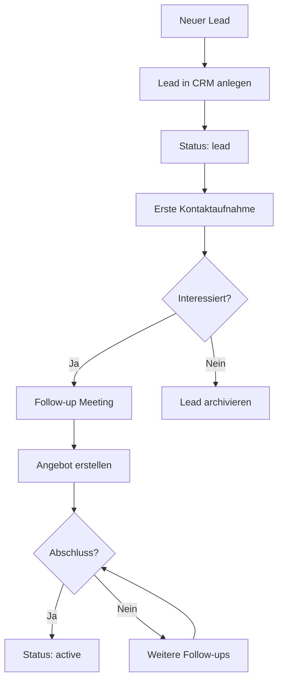
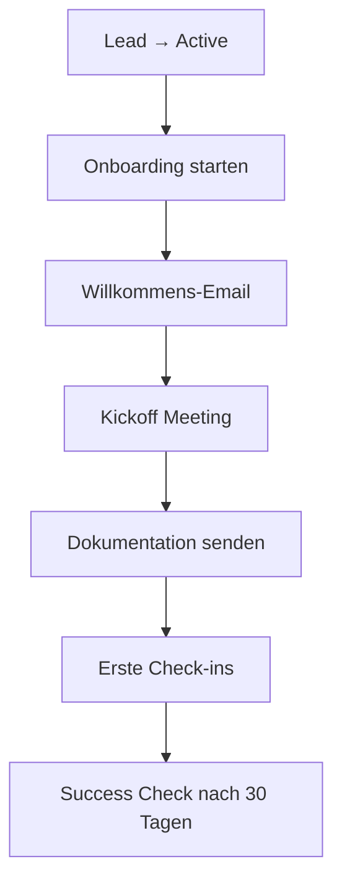
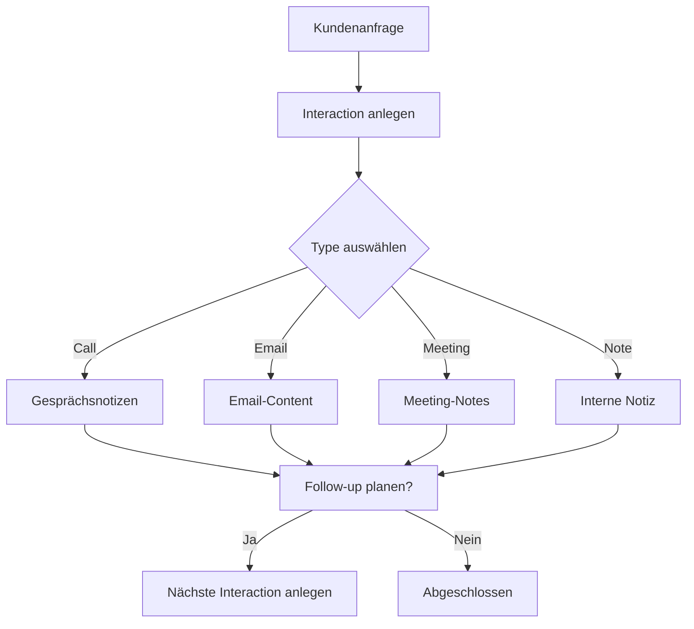
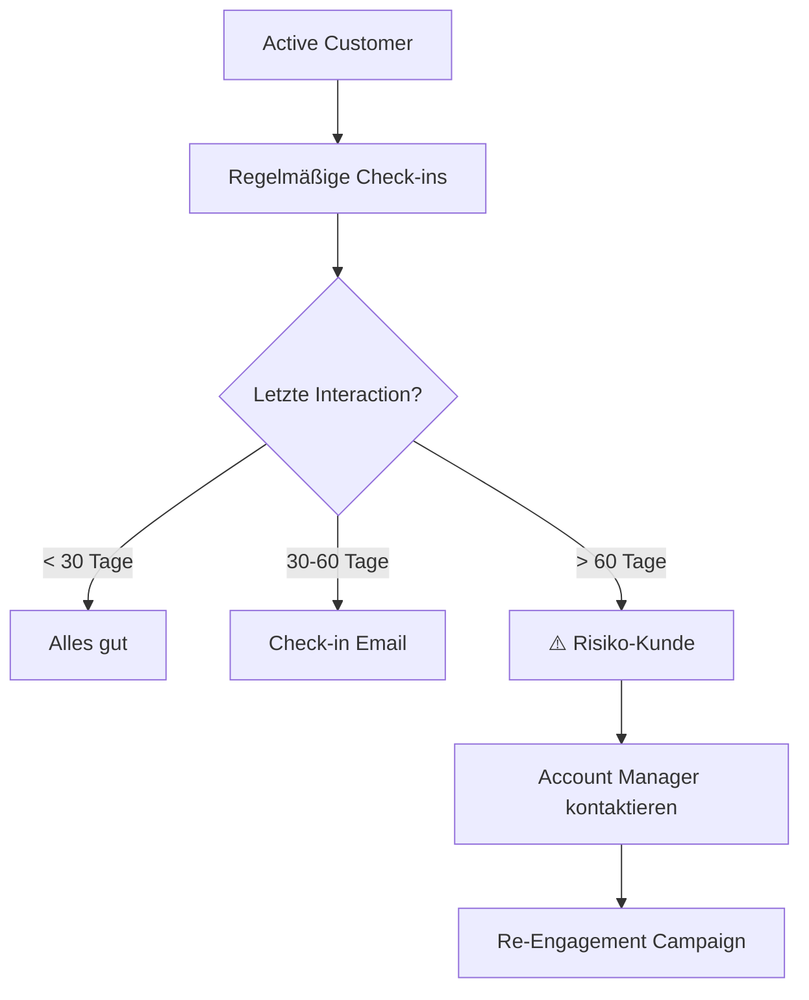
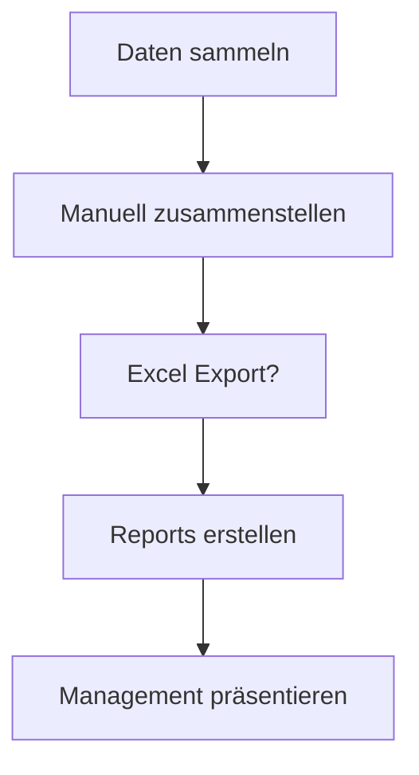

# 🏢 Company Workflow - CRM System

## 📋 Aktueller Workflow (Basierend auf CRM Features)

### 1️⃣ **Lead Management Workflow**

**Aktuelle Schritte:**
1. **Lead Erfassung** (Manual)
   - Name, Email, Phone, Company eingeben
   - Status auf "lead" setzen
   - Notizen hinzufügen

2. **Erste Interaktion** (Manual)
   - Type: "call" oder "email"
   - Subject: "Erstkontakt"
   - Description: Gesprächsnotizen

3. **Follow-up Tracking** (Manual)
   - Weitere Interactions anlegen
   - Notizen aktualisieren
   - Status ändern wenn konvertiert

**⚠️ Probleme:**
- ❌ Keine automatischen Erinnerungen
- ❌ Keine Lead-Scoring
- ❌ Kein Follow-up Tracking
- ❌ Manuelle Status-Updates

---

### 2️⃣ **Customer Onboarding Workflow**

**Aktuelle Schritte:**
1. **Status ändern** (Manual)
   - Von "lead" zu "active"

2. **Willkommens-Prozess** (Komplett Manual)
   - Email manuell schreiben
   - Meeting manuell planen
   - Dokumente manuell versenden

3. **Check-ins tracken** (Manual)
   - Interactions manuell anlegen
   - Kein automatisches Reminder-System

**⚠️ Probleme:**
- ❌ Kein automatisierter Onboarding-Flow
- ❌ Keine Template-Emails
- ❌ Keine Task-Automation
- ❌ Kein Progress-Tracking

---

### 3️⃣ **Customer Interaction Workflow**

**Aktuelle Schritte:**
1. **Interaction erfassen** (Manual)
   - Type wählen
   - Subject eingeben
   - Description schreiben
   - Timestamp wird automatisch gesetzt

2. **Follow-up** (Manual)
   - Manuell merken
   - Neue Interaction anlegen
   - Keine Verknüpfung

**⚠️ Probleme:**
- ❌ Kein Follow-up Reminder
- ❌ Keine Interaction-Chains
- ❌ Kein Email-Integration
- ❌ Keine Template-Responses

---

### 4️⃣ **Customer Retention Workflow**

**Aktuelle Schritte:**
1. **Manuelle Überwachung** (Manual)
   - Dashboard checken
   - Letzte Interactions manuell prüfen

2. **Keine automatische Warnings** (Missing)
   - Keine Alerts bei Inaktivität
   - Keine Risiko-Erkennung

**⚠️ Probleme:**
- ❌ Kein automatisches Monitoring
- ❌ Keine Inaktivitäts-Alerts
- ❌ Kein Risiko-Scoring
- ❌ Keine Retention-Campaigns

---

### 5️⃣ **Reporting & Analytics Workflow**

**Aktuelle Schritte:**
1. **Manuelle Reports** (Manual)
   - Dashboard Stats anschauen
   - Daten manuell exportieren
   - In Excel auswerten

**⚠️ Probleme:**
- ❌ Kein automatisches Reporting
- ❌ Keine Charts/Visualisierungen
- ❌ Keine Trend-Analysen
- ❌ Kein Export-Feature

---

## 🎯 Workflow-Metriken (Aktuell)

| Workflow-Schritt | Automatisierung | Zeit pro Task | Fehleranfälligkeit |
|------------------|-----------------|---------------|-------------------|
| Lead Erfassung | 0% | 5-10 Min | Hoch (Tippfehler) |
| Follow-up Tracking | 0% | 2-5 Min | Mittel |
| Customer Onboarding | 0% | 30-60 Min | Hoch |
| Interaction Logging | 10% (Timestamp) | 3-5 Min | Mittel |
| Retention Monitoring | 0% | 10-15 Min | Hoch |
| Reporting | 5% (Dashboard) | 20-30 Min | Mittel |

**Gesamt:** ~15% automatisiert

---

## 🚀 Nächster Schritt: AI-Automatisierung

Siehe: **AI_AUTOMATION_PLAN.md** (wird erstellt)

---

**Status:** ⚠️ Workflow identifiziert - Bereit für Automatisierung
**Erstellt:** 2025-12-24
**Nächstes Update:** Nach AI-Automatisierung
